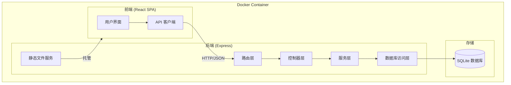
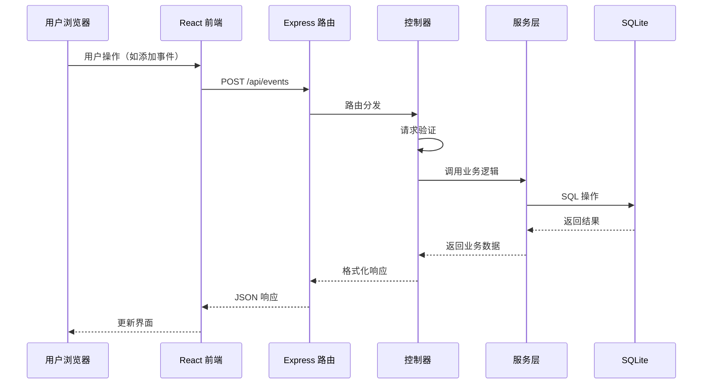
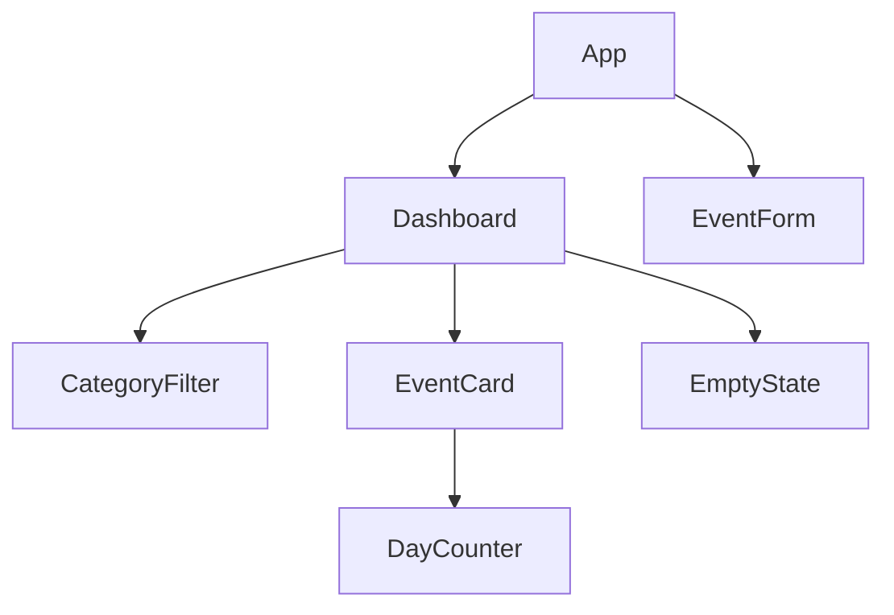

# 技术设计文档：纪念日应用（Anniversary App）

## 概述

纪念日应用是一个全栈 Web 应用，用于记录和管理重要日期。系统采用前后端分离架构，前端使用 React + TypeScript 构建响应式 SPA，后端使用 Node.js + Express 提供 RESTful API，数据持久化使用 SQLite。整个应用通过 Docker 进行容器化部署。

### 技术选型

| 层级 | 技术 | 理由 |
|------|------|------|
| 前端框架 | React 18 + TypeScript | 组件化开发，类型安全，生态成熟 |
| 前端构建 | Vite | 快速的开发体验和构建速度 |
| 前端样式 | CSS Modules | 样式隔离，无额外依赖 |
| 后端框架 | Express.js + TypeScript | 轻量、灵活，适合 RESTful API |
| 数据库 | SQLite（better-sqlite3） | 零配置、文件级数据库，适合单用户/小团队场景 |
| 农历转换 | lunar-javascript | 支持公历农历互转，覆盖范围广，纯 JavaScript 实现 |
| 容器化 | Docker + docker-compose | 一键部署，环境一致性 |

### 设计决策

1. **单容器部署**：前端构建产物由 Express 静态托管，简化部署流程，无需 Nginx 反向代理
2. **better-sqlite3 而非 sqlite3**：同步 API 更简单，性能更好，无需处理异步回调
3. **CSS Modules 而非 Tailwind/Styled-components**：保持轻量，减少学习成本和构建复杂度
4. **无 ORM**：SQLite 表结构简单，直接使用 SQL 查询即可，避免引入不必要的抽象层
5. **lunar-javascript 而非 chinese-lunar**：lunar-javascript 覆盖年份范围更广（公元前722年至公元2200年），支持闰月处理，API 设计清晰

## 架构

### 系统架构图



### 请求流程



## 组件与接口

### 后端组件

#### 1. 路由层（`src/server/routes/eventRoutes.ts`）

定义 RESTful API 端点，将请求分发到对应控制器。

```typescript
// API 端点定义
GET    /api/events          // 获取事件列表，支持 ?category= 筛选
POST   /api/events          // 创建新事件
PUT    /api/events/:id      // 更新事件
DELETE /api/events/:id      // 删除事件
```

#### 2. 控制器层（`src/server/controllers/eventController.ts`）

处理请求验证和响应格式化。

```typescript
interface EventController {
  // 获取事件列表，可选按分类筛选
  listEvents(req: Request, res: Response): void;
  // 创建新事件，验证必填字段
  createEvent(req: Request, res: Response): void;
  // 更新已有事件，验证事件存在性
  updateEvent(req: Request, res: Response): void;
  // 删除事件，验证事件存在性
  deleteEvent(req: Request, res: Response): void;
}
```

#### 3. 服务层（`src/server/services/eventService.ts`）

封装业务逻辑，包括天数计算。

```typescript
interface EventService {
  // 获取所有事件，附带天数计算结果
  getAllEvents(category?: string): EventWithDays[];
  // 创建事件
  createEvent(input: CreateEventInput): Event;
  // 更新事件
  updateEvent(id: number, input: UpdateEventInput): Event;
  // 删除事件
  deleteEvent(id: number): void;
  // 计算事件日期与当前日期的天数差（自动处理农历转换）
  calculateDays(eventDate: string, calendarType: CalendarType, today?: string): DayCalculation;
  // 农历日期转公历日期
  lunarToSolar(lunarDate: string): string;
  // 公历日期转农历日期
  solarToLunar(solarDate: string): LunarDate;
}
```

#### 4. 数据库访问层（`src/server/db/database.ts`）

管理 SQLite 连接和数据操作。

```typescript
interface EventRepository {
  // 初始化数据库表结构
  initialize(): void;
  // 查询所有事件，可选分类筛选
  findAll(category?: string): Event[];
  // 根据 ID 查询事件
  findById(id: number): Event | undefined;
  // 插入新事件
  insert(event: CreateEventInput): Event;
  // 更新事件
  update(id: number, event: UpdateEventInput): Event;
  // 删除事件
  remove(id: number): boolean;
}
```

### 前端组件

#### 1. API 客户端（`src/client/api/eventApi.ts`）

封装与后端 API 的通信。

```typescript
interface EventApi {
  fetchEvents(category?: string): Promise<EventWithDays[]>;
  createEvent(input: CreateEventInput): Promise<Event>;
  updateEvent(id: number, input: UpdateEventInput): Promise<Event>;
  deleteEvent(id: number): Promise<void>;
}
```

#### 2. 页面组件

| 组件 | 路径 | 职责 |
|------|------|------|
| `App` | `src/client/App.tsx` | 根组件，管理全局状态 |
| `Dashboard` | `src/client/pages/Dashboard.tsx` | 首页，展示事件卡片列表 |
| `EventForm` | `src/client/components/EventForm.tsx` | 事件创建/编辑表单 |
| `EventCard` | `src/client/components/EventCard.tsx` | 单个事件卡片展示 |
| `CategoryFilter` | `src/client/components/CategoryFilter.tsx` | 分类筛选栏 |
| `EmptyState` | `src/client/components/EmptyState.tsx` | 空状态引导提示 |
| `DayCounter` | `src/client/components/DayCounter.tsx` | 天数计算展示组件 |

#### 3. 组件层级关系



## 数据模型

### Event 数据模型

```typescript
// 事件基础类型
interface Event {
  id: number;              // 自增主键
  name: string;            // 事件名称（必填）
  date: string;            // 事件日期，ISO 8601 格式 "YYYY-MM-DD"（必填）
  calendarType: CalendarType; // 日历类型：公历或农历（必填，默认 "solar"）
  category: Category;      // 分类（必填，默认 "其他"）
  note: string;            // 备注（可选，默认空字符串）
  icon: string;            // 图标标识（可选，默认由分类决定）
  createdAt: string;       // 创建时间 ISO 8601
  updatedAt: string;       // 更新时间 ISO 8601
}

// 日历类型
type CalendarType = "solar" | "lunar";

// 预设分类枚举
type Category = "恋爱" | "生日" | "纪念日" | "节日" | "其他";

// 农历日期信息
interface LunarDate {
  year: number;            // 农历年
  month: number;           // 农历月（1-12）
  day: number;             // 农历日
  isLeapMonth: boolean;    // 是否闰月
  yearGanZhi: string;      // 干支纪年，如"甲子"
  monthChinese: string;    // 中文月份，如"正月"
  dayChinese: string;      // 中文日期，如"初一"
}

// 天数计算结果
interface DayCalculation {
  days: number;            // 天数差的绝对值
  type: "past" | "future" | "today";  // 过去、未来、今天
  label: string;           // 展示文本，如"已经 100 天"、"还有 30 天"、"就是今天"
  solarDate: string;       // 用于计算的公历日期（农历事件会自动转换）
}

// 带天数计算的事件（API 响应）
interface EventWithDays extends Event {
  dayCalculation: DayCalculation;
  lunarInfo?: LunarDate;   // 农历事件附带农历详细信息；公历事件附带对应农历信息
}

// 创建事件输入
interface CreateEventInput {
  name: string;            // 必填
  date: string;            // 必填，YYYY-MM-DD（公历或农历日期）
  calendarType?: CalendarType; // 可选，默认 "solar"
  category?: Category;     // 可选，默认 "其他"
  note?: string;           // 可选
  icon?: string;           // 可选
}

// 更新事件输入
interface UpdateEventInput {
  name?: string;
  date?: string;
  calendarType?: CalendarType;
  category?: Category;
  note?: string;
  icon?: string;
}
```

### SQLite 表结构

```sql
CREATE TABLE IF NOT EXISTS events (
  id INTEGER PRIMARY KEY AUTOINCREMENT,
  name TEXT NOT NULL,
  date TEXT NOT NULL,          -- YYYY-MM-DD 格式（公历或农历日期）
  calendar_type TEXT NOT NULL DEFAULT 'solar',  -- 'solar' 公历 | 'lunar' 农历
  category TEXT NOT NULL DEFAULT '其他',
  note TEXT DEFAULT '',
  icon TEXT DEFAULT '',
  created_at TEXT NOT NULL DEFAULT (datetime('now')),
  updated_at TEXT NOT NULL DEFAULT (datetime('now'))
);

-- 分类索引，加速筛选查询
CREATE INDEX IF NOT EXISTS idx_events_category ON events(category);

-- 日期索引，加速排序查询
CREATE INDEX IF NOT EXISTS idx_events_date ON events(date);
```

### API 请求/响应格式

#### 成功响应

```json
// GET /api/events
{
  "data": [
    {
      "id": 1,
      "name": "恋爱纪念日",
      "date": "2024-02-14",
      "calendarType": "solar",
      "category": "恋爱",
      "note": "第一次约会",
      "icon": "heart",
      "createdAt": "2024-01-01T00:00:00.000Z",
      "updatedAt": "2024-01-01T00:00:00.000Z",
      "dayCalculation": {
        "days": 100,
        "type": "past",
        "label": "已经 100 天",
        "solarDate": "2024-02-14"
      }
    },
    {
      "id": 2,
      "name": "妈妈生日",
      "date": "2024-08-15",
      "calendarType": "lunar",
      "category": "生日",
      "note": "农历八月十五",
      "icon": "cake",
      "createdAt": "2024-01-01T00:00:00.000Z",
      "updatedAt": "2024-01-01T00:00:00.000Z",
      "dayCalculation": {
        "days": 50,
        "type": "future",
        "label": "还有 50 天",
        "solarDate": "2024-09-17"
      },
      "lunarInfo": {
        "year": 2024,
        "month": 8,
        "day": 15,
        "isLeapMonth": false,
        "yearGanZhi": "甲辰",
        "monthChinese": "八月",
        "dayChinese": "十五"
      }
    }
  ]
}

// POST /api/events（201 Created）
{
  "data": { ... }
}
```

#### 错误响应

```json
// 400 Bad Request
{
  "error": {
    "code": "VALIDATION_ERROR",
    "message": "Validation failed",
    "details": [
      { "field": "name", "message": "Name is required" },
      { "field": "date", "message": "Date must be in YYYY-MM-DD format" }
    ]
  }
}

// 404 Not Found
{
  "error": {
    "code": "NOT_FOUND",
    "message": "Event not found"
  }
}
```

## 正确性属性（Correctness Properties）

*正确性属性是指在系统所有有效执行中都应保持为真的特征或行为——本质上是关于系统应该做什么的形式化声明。属性是人类可读规范与机器可验证正确性保证之间的桥梁。*

### 属性 1：事件创建-查询 Round-Trip

*对于任意*有效的事件输入（包含名称、日期、分类、备注、图标），通过 API 创建该事件后，再通过 API 查询，返回的事件对象应包含所有原始字段且值等价。

**验证需求：Requirements 1.1, 1.6, 6.6**

### 属性 2：事件列表按日期排序

*对于任意*一组已创建的事件，通过 API 获取事件列表时，返回的事件应按日期字段排序。

**验证需求：Requirements 1.2**

### 属性 3：事件更新持久化

*对于任意*已存在的事件和有效的更新输入，执行更新操作后再查询该事件，返回的字段值应反映更新后的内容。

**验证需求：Requirements 1.3**

### 属性 4：事件删除移除

*对于任意*已存在的事件，执行删除操作后，该事件不应再出现在事件列表中，且通过 ID 查询应返回不存在。

**验证需求：Requirements 1.4**

### 属性 5：无效输入拒绝

*对于任意*缺少名称或日期的事件输入，API 应返回 HTTP 400 状态码和验证错误详情，且不应创建任何事件。

**验证需求：Requirements 1.5, 6.5**

### 属性 6：天数计算正确性

*对于任意*事件日期和参考日期（今天），`calculateDays` 函数应满足：
- 当事件日期早于参考日期时，返回 `type: "past"`，`days` 等于两个日期之间的天数差
- 当事件日期晚于参考日期时，返回 `type: "future"`，`days` 等于两个日期之间的天数差
- 当事件日期等于参考日期时，返回 `type: "today"`，`days` 等于 0
- 当日历类型为农历时，应先将农历日期转换为公历日期，再进行天数计算

**验证需求：Requirements 2.1, 2.2, 2.3, 2.4, 2.6**

### 属性 10：农历公历互转一致性

*对于任意*有效的农历日期，将其转换为公历日期后再转回农历日期，应得到与原始农历日期等价的结果（round-trip）。

**验证需求：Requirements 1.8**

### 属性 7：分类筛选正确性

*对于任意*一组事件和任意分类筛选条件，筛选结果中的每个事件的分类字段都应等于所选分类，且结果应包含该分类下的所有事件。

**验证需求：Requirements 3.3, 4.3**

### 属性 8：不存在的资源返回 404

*对于任意*不存在的事件 ID，通过 API 执行查询、更新或删除操作时，应返回 HTTP 404 状态码。

**验证需求：Requirements 6.4**

### 属性 9：数据跨重启持久化

*对于任意*一组已创建的事件，在应用重启（重新初始化数据库连接）后，所有之前创建的事件应仍然可以通过 API 查询到且数据完整。

**验证需求：Requirements 7.3**

## 错误处理

### 错误分类

| 错误类型 | HTTP 状态码 | 错误码 | 处理方式 |
|----------|------------|--------|----------|
| 验证错误（缺少必填字段） | 400 | VALIDATION_ERROR | 返回字段级错误详情 |
| 资源不存在 | 404 | NOT_FOUND | 返回资源类型和 ID |
| 日期格式无效 | 400 | VALIDATION_ERROR | 返回期望的日期格式 |
| 农历日期无效 | 400 | VALIDATION_ERROR | 返回农历日期有效范围说明 |
| 分类值无效 | 400 | VALIDATION_ERROR | 返回有效分类列表 |
| 服务器内部错误 | 500 | INTERNAL_ERROR | 记录日志，返回通用错误信息 |

### 验证规则

```typescript
// 事件验证规则
const eventValidation = {
  name: {
    required: true,
    maxLength: 100,
    // 不允许纯空白字符
    pattern: /\S/
  },
  date: {
    required: true,
    // ISO 8601 日期格式
    pattern: /^\d{4}-\d{2}-\d{2}$/,
    // 必须是有效日期（公历直接验证，农历需验证是否为有效农历日期）
    validate: (v: string, calendarType: CalendarType) => {
      if (calendarType === 'lunar') {
        // 验证农历日期有效性（月份1-12，日期1-30，闰月处理等）
        return isValidLunarDate(v);
      }
      return !isNaN(Date.parse(v));
    }
  },
  calendarType: {
    enum: ["solar", "lunar"],
    default: "solar"
  },
  category: {
    enum: ["恋爱", "生日", "纪念日", "节日", "其他"],
    default: "其他"
  },
  note: {
    maxLength: 500,
    default: ""
  },
  icon: {
    maxLength: 50,
    default: ""
  }
};
```

### 全局错误处理中间件

```typescript
// Express 错误处理中间件
function errorHandler(err: Error, req: Request, res: Response, next: NextFunction) {
  if (err instanceof ValidationError) {
    return res.status(400).json({
      error: { code: "VALIDATION_ERROR", message: "Validation failed", details: err.details }
    });
  }
  if (err instanceof NotFoundError) {
    return res.status(404).json({
      error: { code: "NOT_FOUND", message: err.message }
    });
  }
  // 未知错误，记录日志
  console.error("Unexpected error:", err);
  return res.status(500).json({
    error: { code: "INTERNAL_ERROR", message: "Internal server error" }
  });
}
```

## 测试策略

### 双重测试方法

本项目采用单元测试与属性测试相结合的方式，确保全面覆盖。

#### 属性测试（Property-Based Testing）

- **测试库**：[fast-check](https://github.com/dubzzz/fast-check)（TypeScript 生态中最成熟的属性测试库）
- **最低迭代次数**：每个属性测试至少运行 100 次
- **标签格式**：每个测试必须包含注释引用设计属性
  - 格式：`Feature: anniversary-app, Property {number}: {property_text}`

属性测试覆盖的属性：

| 属性编号 | 属性名称 | 测试描述 |
|---------|---------|---------|
| 属性 1 | 事件 Round-Trip | 生成随机有效事件，创建后查询验证等价性 |
| 属性 2 | 列表排序 | 生成随机事件集合，验证返回列表按日期排序 |
| 属性 3 | 更新持久化 | 生成随机事件和更新数据，验证更新后查询反映变更 |
| 属性 4 | 删除移除 | 生成随机事件，删除后验证不可查询 |
| 属性 5 | 无效输入拒绝 | 生成缺少必填字段的输入，验证返回 400 |
| 属性 6 | 天数计算 | 生成随机日期对和日历类型，验证计算结果正确性 |
| 属性 7 | 分类筛选 | 生成随机事件和分类，验证筛选结果正确性 |
| 属性 8 | 404 响应 | 生成随机不存在的 ID，验证返回 404 |
| 属性 9 | 跨重启持久化 | 生成随机事件，重启后验证数据完整 |
| 属性 10 | 农历公历互转 | 生成随机有效农历日期，验证转公历再转回的 round-trip |

#### 单元测试

- **测试框架**：Vitest（与 Vite 生态集成，速度快）
- **覆盖范围**：

| 测试类别 | 测试内容 |
|---------|---------|
| API 端点 | 验证各端点存在且可访问（需求 6.1） |
| 空状态 | Dashboard 无事件时显示引导提示（需求 3.5） |
| 预设分类 | 验证五个预设分类存在（需求 4.1） |
| 分类图标 | 每个分类有唯一图标/颜色（需求 4.4） |
| 数据库初始化 | 应用启动时自动创建表结构（需求 7.2） |
| 数据库路径 | 支持配置数据库文件路径（需求 7.4） |
| 卡片信息 | 卡片包含名称、日期、天数、图标（需求 3.2） |

### 测试目录结构

```
src/
├── server/
│   └── __tests__/
│       ├── eventService.test.ts        # 服务层单元测试
│       ├── eventService.property.test.ts # 服务层属性测试
│       ├── eventController.test.ts     # 控制器单元测试
│       ├── database.test.ts            # 数据库层测试
│       ├── dayCalculation.property.test.ts # 天数计算属性测试（含农历）
│       └── lunarConversion.property.test.ts # 农历公历互转属性测试
└── client/
    └── __tests__/
        ├── Dashboard.test.tsx          # Dashboard 组件测试
        ├── EventCard.test.tsx          # 事件卡片组件测试
        └── EventForm.test.tsx          # 表单组件测试
```
