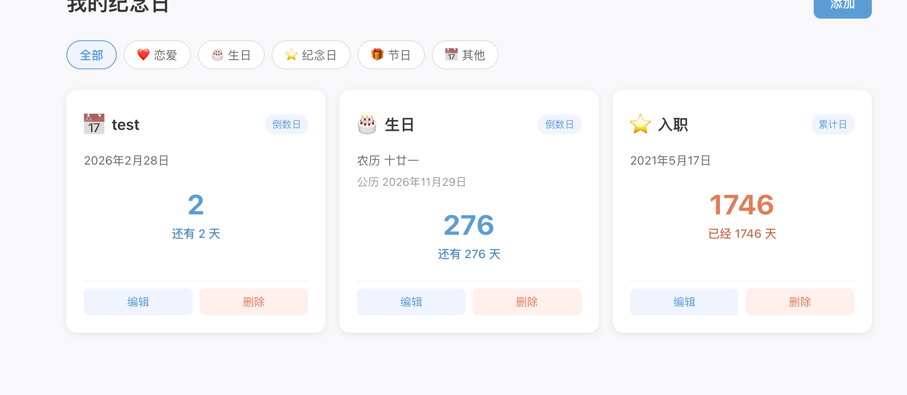

# 纪念日应用

一个用于记录和管理重要日期的 Web 应用，支持公历和农历，帮助你追踪生活中的每一个重要时刻。



## 功能特性

- 📅 支持公历和农历日期
- ⏳ 累计日 / 倒数日两种计数模式
- 🏷️ 多种分类：恋爱、生日、纪念日、节日、其他
- 🔍 按分类筛选事件
- ✏️ 事件的创建、编辑、删除
- 🌙 农历日期自动转换，显示对应公历日期

## 技术栈

- 前端：React 19 + TypeScript + Vite + CSS Modules
- 后端：Express 5 + TypeScript
- 数据库：SQLite（better-sqlite3）
- 农历：lunar-javascript
- 测试：Vitest + fast-check

## 快速开始

### 环境要求

- Node.js >= 24

### 本地开发

```bash
# 安装依赖
npm install

# 启动后端开发服务器
npm run dev:server

# 启动前端开发服务器（另一个终端）
npm run dev:client
```

前端默认运行在 http://localhost:5173，API 请求会代理到后端 http://localhost:8080。

### 构建与部署

```bash
# 构建前端和后端
npm run build

# 启动生产服务
npm start
```

### Docker 部署

```bash
docker compose build
# 使用 Docker Compose 一键启动
docker compose up -d
```

服务默认运行在 8080 端口，可通过 `PORT` 环境变量修改。SQLite 数据库文件存储在 `data/` 目录，通过 volume 挂载实现持久化。

## API 接口

基础路径：`/api/events`

| 方法 | 路径 | 说明 |
|------|------|------|
| GET | `/api/events` | 获取事件列表，支持 `?category=` 筛选 |
| POST | `/api/events` | 创建新事件 |
| PUT | `/api/events/:id` | 更新事件 |
| DELETE | `/api/events/:id` | 删除事件 |

## 项目结构

```
src/
├── client/          # 前端代码
│   ├── components/  # React 组件
│   ├── pages/       # 页面组件
│   ├── api/         # API 请求封装
│   └── styles/      # 全局样式
├── server/          # 后端代码
│   ├── controllers/ # 请求控制器
│   ├── services/    # 业务逻辑层
│   ├── db/          # 数据库操作
│   ├── routes/      # 路由定义
│   └── middleware/   # 中间件
└── shared/          # 前后端共享类型和常量
```

## 测试

```bash
# 运行测试
npm test

# 监听模式
npm run test:watch
```
